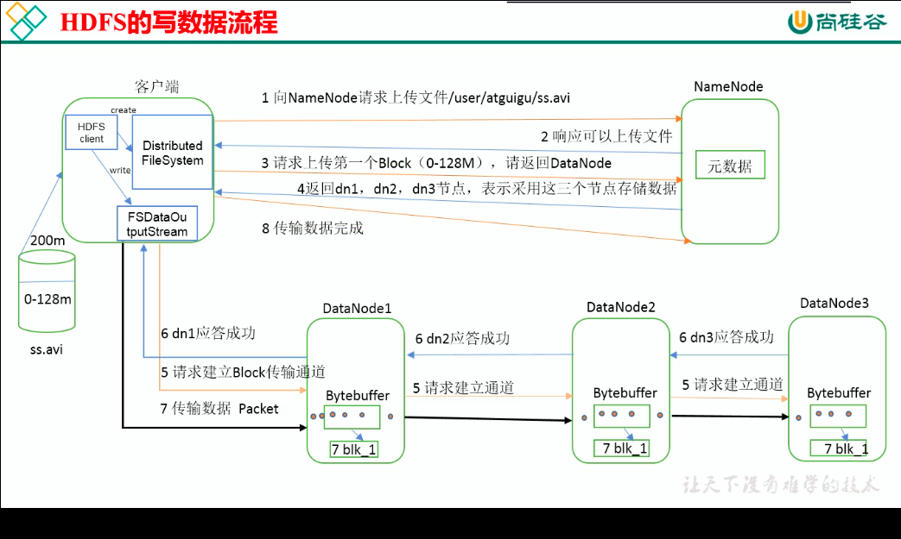

# HADOOP学习

## 0. Hadoop原理


## １．启动YARN并运行MapReduce程序

### 1.1 分析

* 配置集群在YARN上运行MR
* 启动，测试集群增，删，查
  * 测试包含功能测试，性能测试(压力测试)
* 在YARN上执行wordcount案例

### 1.2 配置集群

#### a. 配置yarn-env.sh

配置JAVA_HOME

#### b. 配置yarn-site.xml

```xml
<configuration>
    <!--Reducer获取数据的方式-->
    <property>
        <name>yarn.nodemanager.aux-services</name>
        <value>mapreduce_shuffle</value>
    </property>
    <!--制定YARN的ResourceManager地址-->
    <property>
        <name>yarn.resourcemanager.hostname</name>
        <value>hadoop1</value>
    </property>    
</configuration>
```

#### c. 修改mapred-env.sh

配置JAVA_HOME

#### d. 修改mapred-site.xml

```xml
<configuration>
    <!--制定MR运行在YARN上-->
    <property>
        <name>mapreduce.framework.name</name>
        <value>yarn</value>
    </property>   
</configuration>
```

#### e. 启动resourcemanager,nodemanager

```shell
./sbin/yarn-daemon.sh start resourcemanager
./sbin/yarn-daemon.sh start nodemanager
```

启动后可以通过:http://192.169.0.101:8088/ 查看map reduce任务

## 2. 配置历史服务器

修改mapred-site.xml

```xml
<configuration>
    <!--历史服务器地址-->
    <property>
        <name>mapreduce.jobhistory.address</name>
        <value>hadoop1:10020</value>
    </pr	operty>
        <!--历史服务器web端地址-->
    <property>
        <name>mapreduce.jobhistory.webapp.address</name>
        <value>hadoop1:19888</value>
    </property> 
</configuration>
```

修改日志聚集

开启日志狙击，可以方便查看程序运行的详情，方便开发调试。

开启日志聚集功能，需要重启NodeManager,ResourceManager和HistoryManager

修改yarn-site.xml

```xml
 <!--使用日志聚集功能-->    
	<property>
        <name>yarn.log-aggregation-enable</name>
        <value>true</value>
    </property>
 <!--日志保存时间-->  
    <property>
        <name>yarn.log-aggregation.retain-seconds</name>
        <value>604800</value>
    </property>
```

## 3. 完全分布式运行模式

## 4. HADOOP编译

TODO

## 5. Hadoop写入数据流程

* 写入流程

