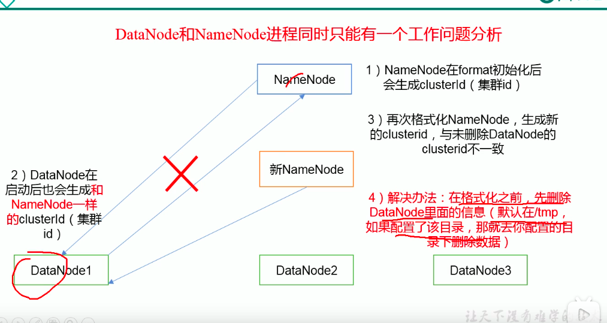
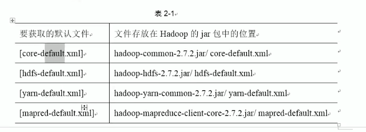

# docker搭建haodop集群

update:13:00

## 1. docker设置网络

### 1.1 docker镜像查看IP

方法一：

```shell
#安装相关工具
apt-get update
apt-get install net-tools,iputils-ping
```

安装后就可是使用ifconfig查看镜像内IP

方法二：

```shell
# 列出容器所有信息
docker inspect 容器ID
docker inspect 容器ID | grep IPAddress 
```


### 1.2  docker创建网络固定IP

docker安装默认会创建三种网络192.169.0.101

```shell
docker network ls

NETWORK ID          NAME                DRIVER              SCOPE
0366d22ec68b        bridge              bridge              local
6513200a11e0        host                host                local
abf6732e8064        none                null                local
```

* bridge:网络桥接

默认情况下启动，创建容器都使用该模式，所以每次docker容器启动会按照顺序获取对应的IP地址，所以每次重启IP都会发生变化。

* none:无指定网络

启动容器时，可以通过－network=none,docker容器不会分配局域网IP

#### 创建固定IP

如果使用默认的网络无法

```shell
root@helian-N9x0TC:~# docker run --rm -it --net bridge --ip 172.17.0.10  ubuntu_ssh 
docker: Error response from daemon: user specified IP address is supported on user defined networks only.
```

创建自动以网络类型

```shell
docker network create --subnet=192.169.0.0/16 staticnet
```

使用新的网络类型创建容器,指定固定IP

```shell
docker run --rm -it --net staticnet --ip 192.169.0.10  ubuntu_ssh 
```

### 1.3 通过IP访问下的端口映射

docker容器内，开启了某个端口，在可以通过使用IP:port方式访问，以下是我做了一个简单测试：

```shell
touch "hello" > index.html
python -m SimpleHTTPServer 9001
```

使用web服务器查看,输入http://192.169.0.101:9001/

可以看到hello


## ２.制作hadoop容器

### 2.1 haodop容器待安装的组件:

* jdk
* hadoop
* ssh
  * 设置免密

### 2.2 具体步骤

* #### 创建一个临时容器用于安装组件

```shell
docker run --name=temp_container -it  ubuntu_ssh
```

* #### ssh安装

```shell
apt-get install openssh-server
```

确认sshserver是否启动

```shell
ps -e|grep ssh
#如果没有启动则启动
/etc/init.d/ssh start
#ssh配置文件在/etc/ssh/sshd_config
#配置完毕重启sshserver
/etc/init.d/ssh restart
```

默认情况下root不允许远程ssh远程登录,需要修改文件以下配置

```shell
LoginGraceTime 120
PermitRootLogin yes #prohibit-password
StrictModes yes

#允许无密码登录
PermitEmptyPasswords　yes
```

设置免密ssh

TODO

* #### 安装jdk以及hadoop

主机上拷贝jdk,hadoop文件到容器中

```shell
docker cp ~/下载/hadoop-2.9.2.tar.gz temp_container2:/opt/modules
docker cp ~/下载/jdk-8u191-linux-x64.tar.gz temp_container2:/opt/modules
```

容器中运行

```shell
tar -zvxf hadoop-2.9.2.tar.gz -C /opt/modules
tar -zvxf jdk-8u191-linux-x64.tar.gz -C /opt/modules
```

编辑/etc/profile,添加以下内容

```shell
#java env setup
#20201128
export JAVA_HOME=/opt/modules/jdk1.8.0_191
export PATH=$PATH:$JAVA_HOME/bin

#hadoop env
export HADOOP_HOME=/opt/modules/hadoop-2.9.2
export PATH=$PATH:$HADOOP_HOME/bin
export PATH=$PATH:$HADOOP_HOME/sbin
```

加载

```shell
source /etc/profile
#test
java -version
hadoop version
```

如果启动容器JAVA_HOME没有加载编辑 ~/.bashrc

```shell
source /etc/profile
```


* #### 保存容器

```shell
docker commit temp_container2 ubuntu_hadoop
```


## 3. 集群hadoop搭建

启动３个镜像设置为hadoop1,hadoop2,hadoop3

```shell
docker run -it --name=hadoop1 --net staticnet --ip 192.169.0.100  ubuntu_hadoop
docker run -it --name=hadoop2 --net staticnet --ip 192.169.0.101  ubuntu_hadoop
docker run -it --name=hadoop3 --net staticnet --ip 192.169.0.102  ubuntu_hadoop
```

### 3.1 hadoop配置文件

etc/hadoop/core-site.xml

> core-site.xml配置说明https://hadoop.apache.org/docs/stable/hadoop-project-dist/hadoop-common/core-default.xml

```xml
<configuration>
    <!--指定HDFS中NameNode的地址-->
    <property>
        <name>fs.defaultFS</name>
        <value>hdfs://localhost:9000</value>
    </property>
    <!--指定hadoop运行时产生的文件的存储目录-->
    <property>
        <name>hadoop.tmp.dir</name>
        <value>/opt/module/hadoop-2.9.2/data/tmp</value>
    </property>
</configuration>
```

etc/hadoop/hadoop-env.sh

```shell
# The only required environment variable is JAVA_HOME.  All others are
# optional.  When running a distributed configuration it is best to
# set JAVA_HOME in this file, so that it is correctly defined on
# remote nodes.

# The java implementation to use.
export JAVA_HOME=/opt/modules/jdk1.8.0_191
```

etc/hadoop/hdfs-site.xml

```xml
<configuration>
    <!--副本数目，默认是３-->
    <property>
        <name>dfs.replication</name>
        <value>1</value>
    </property>
</configuration>
```

```shell
#格式化NameNode
$hdfs namenode -format
$hadoop-daemon.sh start namenode
$hadoop-daemon.sh start datanode
#查看ＪＡＶＡ进程
$jps
```

如下显示表明hadoop可以工作了

```shell
root@hadoop1:/opt/modules/hadoop-2.9.2# jps
5234 NameNode
5337 DataNode
5388 Jps
```

web下 192.168.0.101:50070

TODO

### 3.2 存储文件数据

/opt/modules/hadoop-2.9.2/data/tmp/dfs/name/current/VERSION

```shell
namespaceID=1126627060
clusterID=CID-30987b91-f742-47a6-bcf8-aecbca9a2643
cTime=1606633954515
storageType=NAME_NODE
blockpoolID=BP-587666436-192.169.0.101-1606633954515
layoutVersion=-63
```

/opt/modules/hadoop-2.9.2/data/tmp/dfs/data/current/VERSION

```shell
#Sun Nov 29 15:12:25 HKT 2020
storageID=DS-56794741-e536-4e53-8c02-956524bec263
clusterID=CID-42f99f0c-8ace-401d-b9be-321e527b7398
cTime=0
datanodeUuid=a5d8935d-e9c8-44ba-a264-dba83d3c879e
storageType=DATA_NODE
layoutVersion=-57
```

两边的clusterID不一致：解决办法



## ４.集群下常用操作

* 创建目录
* 上传文件

```shell
hdfs dfs -put 上传内目录 hdfs目录
```

* 默认配置文件

