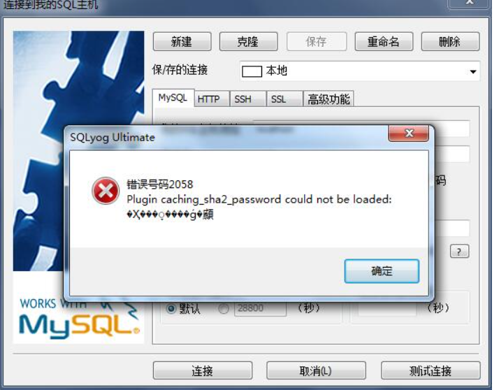

# mybatis学习

## 1 Mybatis介绍

官网： https://mybatis.org/mybatis-3/zh/getting-started.html

### 1.1 什么是Mybatis


* MyBatis 是一款优秀的**持久层框架**，
* 它支持自定义 SQL、存储过程以及高级映射。
* MyBatis 免除了几乎所有的 JDBC 代码以及设置参数和获取结果集的工作。
* MyBatis 可以通过简单的 XML 或注解来配置和映射原始类型、接口和 Java POJO（Plain Old Java Objects，普通老式 Java 对象）为数据库中的记录
* MyBatis 本是[apache](https://baike.baidu.com/item/apache/6265)的一个开源项目[iBatis](https://baike.baidu.com/item/iBatis), 2010年这个项目由apache software foundation 迁移到了google code，并且改名为MyBatis 。2013年11月迁移到Github。

  获取Mybatis

* maven仓库

  ```Java
  <!-- https://mvnrepository.com/artifact/org.mybatis/mybatis -->
  <dependency>
      <groupId>org.mybatis</groupId>
      <artifactId>mybatis</artifactId>
      <version>3.5.5</version>
  </dependency>
  ```

* Github：https://github.com/mybatis/mybatis-3

* Github中文：https://github.com/tuguangquan/mybatis

### 1.2 持久化

数据持久化

* 持久化指的是将程序数据在持久状态（SSD）和瞬时状态(内存)转化的过程。
* 持久化方式，jdbc,io文件等

### 1.3 持久层

Dao层，Service层，Controller层

* 完成持久化工作的代码快
* 层界限明显

### 1.4 为什么使用Mybatis

* 简化传统的JDBC代码，框架（就像简历格式一样，方便标准和自动化）。
* 不用Mybatis也可以，但这个跟容易上手
* 简单易学：本身就很小且简单。没有任何第三方依赖，最简单安装只要两个jar文件+配置几个sql映射文件易于学习，易于使用，通过文档和源代码，可以比较完全的掌握它的设计思路和实现。
* 灵活：mybatis不会对应用程序或者数据库的现有设计强加任何影响。 sql写在xml里，便于统一管理和优化。通过sql语句可以满足操作数据库的所有需求。
* 解除sql与程序代码的耦合：通过提供DAO层，将业务逻辑和数据访问逻辑分离，使系统的设计更清晰，更易维护，更易单元测试。sql和代码的分离，提高了可维护性。
* 提供映射标签，支持对象与数据库的orm字段关系映射
* 提供对象关系映射标签，支持对象关系组建维护
* 提供xml标签，支持编写动态sql。 [2]

## 2 第一个Mybatis程序

思路：搭建环境 -> 导入Mybatis -> 编写代码 -> 测试（正确的废话）

### 2.1 搭建环境

搭建数据库

> 扩展Mysql下engine InnoDB和MyISAM的区别
>
> **1. InnoDB支持事务，MyISAM不支持，对于InnoDB每一条SQL语言都默认封装成事务，自动提交，这样会影响速度，所以最好把多条SQL语言放在begin和commit之间，组成一个事务；** 
>
> **2. InnoDB支持外键，而MyISAM不支持。对一个包含外键的InnoDB表转为MYISAM会失败；** 
>
> **3. InnoDB是聚集索引，使用B+Tree作为索引结构，数据文件是和（主键）索引绑在一起的（表数据文件本身就是按B+Tree组织的一个索引结构），必须要有主键，通过主键索引效率很高。但是辅助索引需要两次查询，先查询到主键，然后再通过主键查询到数据。因此，主键不应该过大，因为主键太大，其他索引也都会很大。**

### 2.2 mysql server安装

mysql server官网下载：https://dev.mysql.com/downloads/mysql/

* 安装
* 目录下创建my.ini配置

```ini
[client]
# 设置mysql客户端默认字符集
default-character-set=utf8
 
[mysqld]
# 设置3306端口
port = 3306
# 设置mysql的安装目录
basedir=C:\\web\\mysql-8.0.11
# 设置 mysql数据库的数据的存放目录，MySQL 8+ 不需要以下配置，系统自己生成即可，否则有可能报错
# datadir=C:\\web\\sqldata
# 允许最大连接数
max_connections=20
# 服务端使用的字符集默认为8比特编码的latin1字符集
character-set-server=utf8
# 创建新表时将使用的默认存储引擎
default-storage-engine=INNODB
```

以管理员身份，进入到bin目录

```bash
mysqld --initialize --console
```

执行完成后，会输出 root 用户的初始默认密码，如：

```bash
...
2018-04-20T02:35:05.464644Z 5 [Note] [MY-010454] [Server] A temporary password is generated for root@localhost: APWCY5ws&hjQ
...
```

* 启动mysql服务

```bash
net start mysql
```

>  注意避免使用中文名

修改root密码

```mysql
alter user user() identified by "root";
update mysql.user set authentication_string=password('root') where user='root' and Host ='localhost';
```

如果password不能用可以更改为md5



密码的加密方法由问题所以要重新修改

修改密码的方法2

```bash
打开cmd：mysql -uroot -p 

进入mysql依次执行下面语句

ALTER USER 'root'@'localhost' IDENTIFIED BY 'password' PASSWORD EXPIRE NEVER; #修改加密规则 

ALTER USER 'root'@'localhost' IDENTIFIED WITH mysql_native_password BY 'password'; #更新一下用户的密码 

FLUSH PRIVILEGES; #刷新权限

alter user 'root'@'localhost' identified by 'xzx123456';#重置密码，xzx123456就是变更后的密码，自己的密码自己更改下哦
```

2.3 msyql环境

```mysql
CREATE DATABASE `mybatis`;

USE mybatis

CREATE TABLE `user`(
`id` INT(20) NOT NULL PRIMARY KEY,
`name` VARCHAR(30) DEFAULT NULL,
`pwd` VARCHAR(30) DEFAULT NULL
)ENGINE=INNODB DEFAULT CHARSET="utf8"

INSERT INTO `user`(`id`,`name`,`pwd`) VALUES
(1,"lian1","123456"),
(2,"lian2","123456"),
(3,"lian3","123456")

SELECT * FROM `user`
```

### 2.3 环境搭建

* 创建maven project
* 导入相关的dependency

```xml
    <!--父工程-->
    <!--导入依赖-->
    <dependencies>
<!--        mysql驱动-->
        <dependency>
            <groupId>mysql</groupId>
            <artifactId>mysql-connector-java</artifactId>
            <version>8.0.21</version>
        </dependency>
<!--        mybatis-->
        <!-- https://mvnrepository.com/artifact/org.mybatis/mybatis -->
        <dependency>
            <groupId>org.mybatis</groupId>
            <artifactId>mybatis</artifactId>
            <version>3.5.5</version>
        </dependency>
<!--        junit-->
        <dependency>
            <groupId>junit</groupId>
            <artifactId>junit</artifactId>
            <version>4.12</version>
        </dependency>
    </dependencies>
```

### 2.4 创建一个模块

#### 2.4.1 简单查询调用方式

xml包含MyBatis核心配置：

* 数据库连接实例数据源(Datasource)
* 事务作用域和控制方式的事务管理器(TranscationManager)

```xml
<?xml version="1.0" encoding="UTF-8" ?>
<!DOCTYPE configuration
        PUBLIC "-//mybatis.org//DTD Config 3.0//EN"
        "http://mybatis.org/dtd/mybatis-3-config.dtd">
<!--核心配置文件-->
<configuration>
    <environments default="development">
        <environment id="development">
            <transactionManager type="JDBC"/>
            <dataSource type="POOLED">
                <property name="driver" value="com.mysql.cj.jdbc.Driver"/>
                <property name="url" value="jdbc:mysql://localhost:3306/mybatis?serverTimezone=UTC&amp;useSSL=true&amp;userUnicode=true&amp;characterEncoding=UTF-8"/>
                <property name="username" value="root"/>
                <property name="password" value="123456"/>
            </dataSource>
        </environment>
    </environments>
    <!--直接放到Resource目录方便查找，指定接口实现的的xml-->
    <mappers>
        <mapper resource="UserDao.xml"/>
    </mappers>
</configuration>
```

定义接口UserDao

```java
public interface UserDao {
    List<User> getUserLists();
}
```

填写UserDao的xml形式封装

```xml
<!--给什么类实现-->
<mapper namespace="com.lian.user.UserDao">
<!--返回类型-->
    <select id="getUserLists" resultType="com.lian.pojo.User">
        select * from mybatis.user
    </select>
</mapper>
```

调用部分

```java
public class MybatisConnectTest {
    @Test
    public void test(){
        MybatisConnect connect = new MybatisConnect();
        SqlSession session = connect.getSession();
        UserDao userDao =  session.getMapper(UserDao.class);
//      查询
        List<User> users= userDao.getUserLists();
        for(User user : users){
            System.out.println(user.toString());
        }
        session.close();
    }
}

```

### 2.5 增删改

增删改的工作也均可以使用xml配置来使用。

```xml
<insert
  id="insertAuthor"
  parameterType="domain.blog.Author"
  flushCache="true"
  statementType="PREPARED"
  keyProperty=""
  keyColumn=""
  useGeneratedKeys=""
  timeout="20">

<update
  id="updateAuthor"
  parameterType="domain.blog.Author"
  flushCache="true"
  statementType="PREPARED"
  timeout="20">

<delete
  id="deleteAuthor"
  parameterType="domain.blog.Author"
  flushCache="true"
  statementType="PREPARED"
  timeout="20">
```

### 2.6 sql

定义可重用SQL代码片段，通过include元素的方式进行复用

```xml
<sql id="userColumns"> ${alias}.id,${alias}.username,${alias}.password </sql>


<select id="selectUsers" resultType="map">
  select
    <include refid="userColumns"><property name="alias" value="t1"/></include>,
    <include refid="userColumns"><property name="alias" value="t2"/></include>
  from some_table t1
    cross join some_table t2
</select>
```

