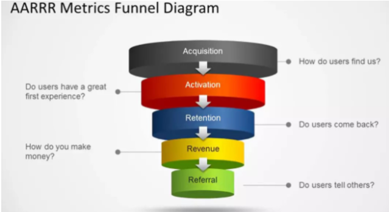

## 1. 黑客增长

### 1.1 入门：

* 作者：肖恩·埃利斯（Sean Ellis） 2010年Qualaroo的创始人提出
* “广告教父”大卫·麦肯兹·奥格威（David MacKenzie Ogilvy)  创建奥美广告公司成为世界上最大的广告公司之一，曾说过下面内容，这个主要也是表现推销的重要性。

> “在现代商业世界里，当一个才华横溢的创造者是没用的，除非你能同时把你创造的东西推销出去”

**传统广告**：在人流量大的街道上打出巨幅的广告，或者在电视台、广播台做广告，或者在杂志、报纸、传单上印刷广告

**弊端**：

1. 难以量化，难以衡量营销投入产出效率。（毕竟广告周期长，归因上麻烦）
2. 广告启动价格高，小型公司难以承担。

**增长黑客(Growth Hacker)做的事情--通过一套方法，低成本的驱动初创公司用户增长**如Hotmail例子。

### 1.2 AARRR模型

“获取（Acquisiton)”“激活(Activation)”“留存(Retention)”“收入(Revenue)”“传播(Refer)”

增长黑客就是站在用户与企业产品打交道，考虑全生命周期，提升各个环节之间的转化效率。

* 搜索引擎优化（SEO）

* 邮件营销自动化（这个环节和Push有点像，push本身也是通过推送渠道和客户**主动建立关系**的一种方式）

  讲CRM（客户关系管理）和EDM(邮件直接营销)系统接通，对不同的用户自动化推送不同的营销邮件。通过不同的邮件内容可以在“获取(Acquision)”“激活（Activation）”和""留存(Rentention)“等环节都产生效果。

* 病毒式传播 （设置激发用户主动分享的功能）提高传播和获取循环

  * 微信裂变
  * 社群运营

## 2. ABTest理论

### 2.1 概念

* AB-Test功能:支持产品和业务决策，实现业务持续和快速增长
* 思想：用少量样本估计策略影响，并评估策略上线后的影响。
* 核心要解决先验性和准确性。先验性在于策略上线前评估出对整体系统的影响。准确性在于样本数据准确评估总体的数据。

### 2.2 分类

