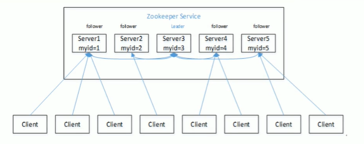
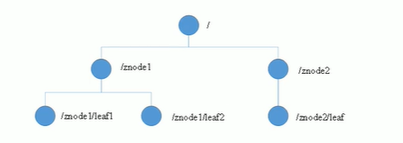
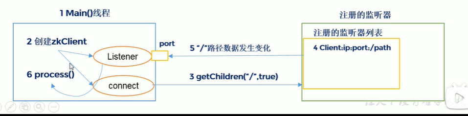

# ZooKeeper

## 1. zookeeper入门

### 1.1 概述

* 开源分布式，提供**协调服务**Apache项目
* 观察者模式的分布式服务管理框架，负责存储和管理数据，接收观察者注册，一旦数据发生变化，zookeeper就通知已经在zookeeper上注册的观察者做出反应。
* Zookeeper  = 文件系统 + 通知机制

### 1.2 特点



* Zookeeper：一个领导者(Leader)，多个跟随着(Follower)组成的集群
* 半数以上存货，服务器正常服务。 （这些都是保证数据的完整性）
* 每个Server都保存一份相同的数据副本
* 更新请求顺序执行（避免并发带来数据不一致）
* 数据更新事务性。
* 实时性

### 1.3  数据结构

和unix文件系统类型，每个节点是一个Znode,能够存储1MB数据，每个ZNode通过路径唯一标识。



### 1.4 应用场景

* 统一命名服务
* 统一配置管理
* 统一集群管理
* 服务器节点动态上下线
* 软负载均衡

## 2. 安装

### 2.1 本地模式安装

解压zookeeper

```shell
mv zoo-sample.cfg zoo.cfg
#设置dataDir
```

启动

```shell
#启动服务
./bin/zkServer.sh start
jps
#启动客户端,启动后通过quit退出,另外主动通知还没测试过。
./bin/zkCli.sh
#关闭服务
./bin/zkServer.sh stop
```

### 2.2 分布式安装部署

* 集群规划
* 解压安装
* 配置服务器编号
  * 在zkData下创建myid
  * 编辑myid给编号
* 配置zoo.cfg
  * 和单机模式相似
  * 但需要加入以下数据

```shell
#A myid
#B ip or host
#C 主从数据往来通信端口
#D 主从选举信息往来端口
server.A=B:C:D
```

* 运行./bin/zkServer.sh start依次启动每个服务器上的zk

## 3. 内部原理

### 3.1 选举机制

​	zk没有在配置中明确指出Master和Slave，但是工作时，有一个是Leader，其他设置为Follower，Leader是通过内部选举机制临时产生。

* 每个机器先选自己，如果没选定，则投给比他大的下一个持续此过程直到选出（超过半数）。

## 4. 开发实战

### 4.1 操作

* 创建 create

  * create /tmpnode "hello" 节点创建笔记传值
  * -e 临时节点，客户端关掉就断开（**方便监控服务器宕机或下线，应为下线就删除可以被监听到**）

* 修改节点值set 

* 获取节点值get

* 监听节点值变化

  * 注册监听节点 get path [watch] 一次有效提示修改后需要重新注册监听

    > 也合理，又一些事件变更后也许不必再次监听，或者监听对象都改变了。

  * 注册监听目录ls path [watch] 或 ls -w path

* 删除节点

### 4.2 监听器原理

* 客户端创建两个线程listener和connect
* connet发送注册事件给zkServer
* zkserver将事件写入队列
* 一旦监听事件发生变化则会发送事件给listener
* listener调用process()



### 4.3 写数据流程

* 简单说来就是写数据必须由leader发起，如请求的是slaver也会由slaver再去请求leader，半数以上服务器写成功就算成功
* 成功后再由leader告诉初始请求的server把成功消息返回给client.

### 4.4 API应用